# AlgorithmProject2
算法作业第二个Project
我们最终的运行结果可以查看

* 本文档最下面的 12.10（Final）处
* 或者 实验报告
* 或者 log文件夹中 Final_test1.log, Final_test2.log, Final_test3.log 的内容

## 运行
在src目录下
若是要编译文件，可直接
```
make 
```
若是要run，可直接
```
make run
```
若是要清楚生成的编译文件 
```
make clean
```
附上makefile的文件截图
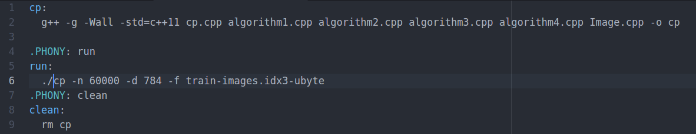


## 文件目录
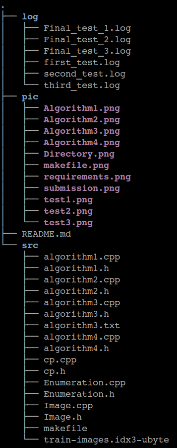

* log 用于保存我们实验过程中每次测试的报告
* pic 保存README中的截图
* README.md 用于保存我们如何完成大作业的过程，包括难点等
* src 保存源代码
	* cp.cpp cp.h 主函数，完成文件读取以及整个流程控制
	* algorithm1.h, algorithm1.cpp 实现组织Random projection和两个排序算法的组织
	* algorithm2.h algorithm2.cpp 实现Random Projection
	* algorithm3.h algorithm4.h 实现归并
	* algorithm4.h algorithm4.cpp 实现特殊的快排
	* Image.h Image.cpp 实现对图像的统一存储与处理
	* Enumeration.h Enumeraion.cpp 实现枚举最佳选项（用于优化结果）

## 以下是我们做作业的过程
### 作业要求
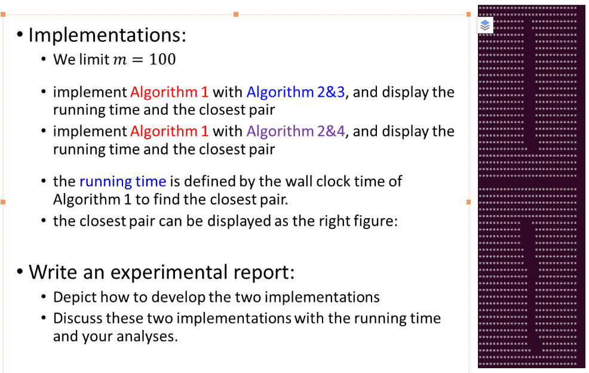

Algorithm 1 是概述整体的流程
Algorithm 2 是随机投影的实现
Algorithm 3 和 4是排序以及需找最近对的方法， 3 是合并排序 4是快排

### 分工 ？
* Algotirhm2&3实现（算法的实现按照函数的形式） 
* Algorithm2&4实现
* 读取数据，存储数据，显示数据（简单实现了三个功能，用类包装，可以直接调用），这里可以实现主程序
* 枚举法求解
* 文档（应该可以分配给写算法的人进行running time的分析）

### 提交
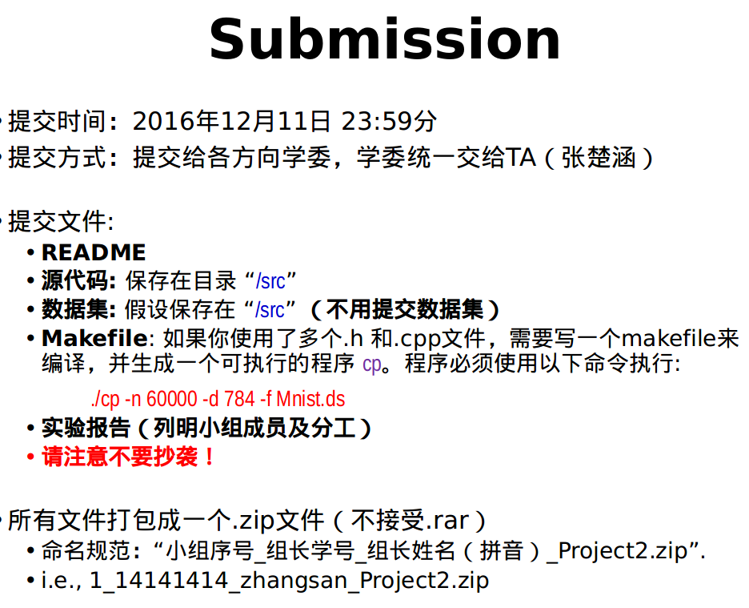

### 难点
~~这个算法要实现最优化的参数设置，找多几组数据测试，然后暴力找到最优化解以及次优，第三优，等等，看看算法实现出来的结果怎么样。m该怎么取~~
实际上维度是确定的

### 算法截图
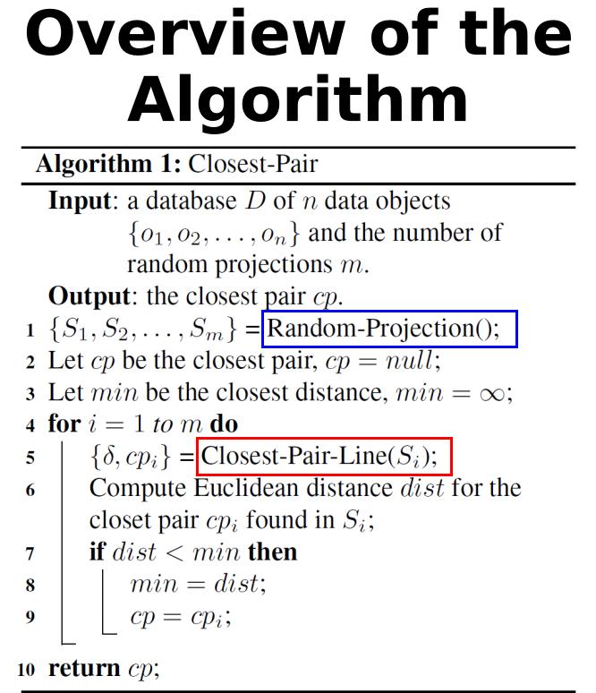
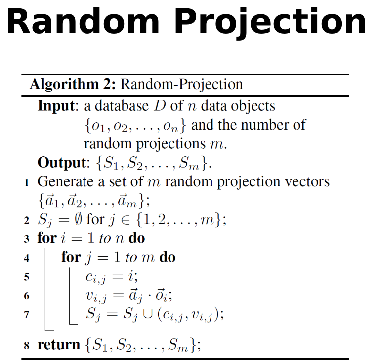
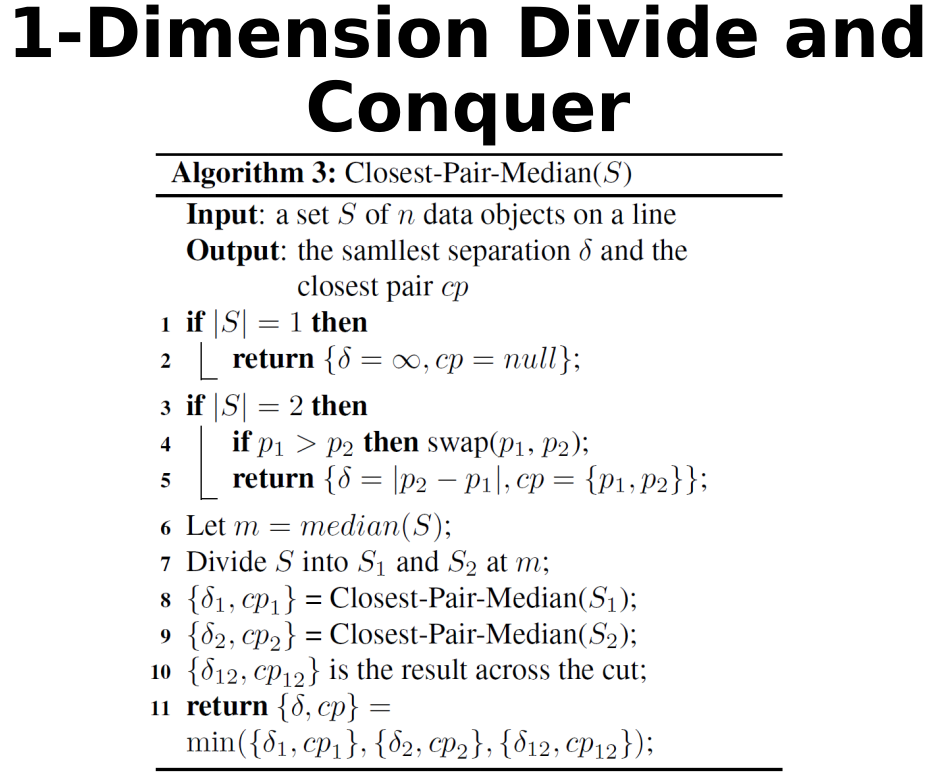
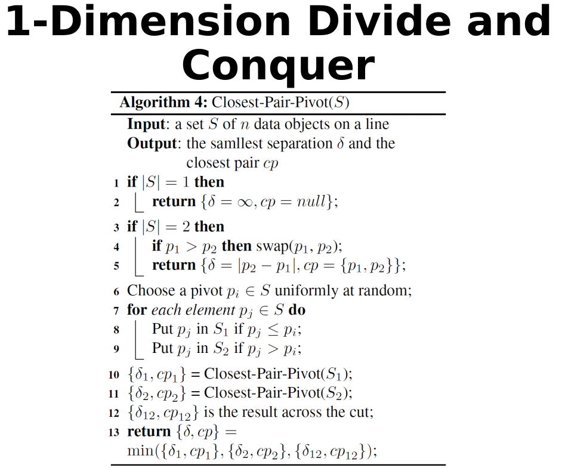


### 编译
> g++ -std=c++11 cp.cpp algorithm1.cpp algorithm2.cpp algorithm3.cpp algorithm4.cpp Enumeration.cpp Image.cpp -o cp

### 运行
在src下
> ./cp -n 60000 -d 784 -f train-images.idx3-ubyte

### 进程
#### 11.27
* A1, A2, A3, A4 Enumeration可以跑
* 效果比较差
* makefile不能启动，只能 
g++ -std=c++11 cp.cpp algorithm1.cpp algorithm2.cpp algorithm3.cpp algorithm4.cpp Enumeration.cpp Image.cpp -o cp
* 第一次输出结果查看first_test.log

#### 11.28 
* 第二次输出结果查看second_test.log
枚举出来的效果表明，我们的算法的效果很不行
* Enumeration函数为了返回多个pair，因而修改了返回的形式参数的模样为vector< pair<int,int> >

#### 12.2
显然，根据日志观察到两个算法花费的时间都是颇为巨大的
已经有小组能把时间限制到20s，而我们两个算法最快的也是其15倍，最慢的是20倍。
需要优化
包括映射，两个排序
以及每个部分都要编写相应的文档

#### 12.9 优化
主要是对cp.cpp和Algorithm1.cpp的修改  
增加了cp.h文件  
以及
还有makefile具备三个功能

```
make // 编译文件
make clean // 清除生成的运行文件
make run // 运行文件
```
* cp.cpp中形成将 大端转小端 写成一个新函数， 将文件转化为Image类写成一个函数
* Algorithm1.cpp将原本的两个函数（一个执行归并排序，一个执行快排序）合并为一个，共用相同的随机向量
* Algorithm1.cpp将所有文件中存储所有图像映射到所有随机向量上的向量机中在Closet_Pair函数中，只用声明初始化一次，减少内存以及声明的时间
* 最重要的修改莫过于按照proj的要求，将随机向量的数量从 **60000** 减少到 **100**，缩小了600，花费时间明显减少
* Algorithm3和Algorithm4的接口改变
* Image的打印的图像的样式反转了

等algorithm3和4修改完，合并再进行最后测试

#### 12.10 Final（包含测试结果）
代码合并完成，文档完成,测试完成
我们一共测试了三次，分别测量了单独使用Random Project+归并花费时间，和单独Random Project+快排花费时间，其中Random Project两者是一样的

|    次数    | 使用归并 | 使用特殊快排 | 
| ---------- | ---------- | ---------- |
| 第一次 |   25.3144s | 21.2093s |
| 第二次 |  26.2554s | 21.8885s |
| 第三次 |  26.2676s | 21.7504s |

输出的图像的结果表明还是比较相近的，偶尔出现相差比较大的

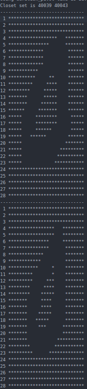

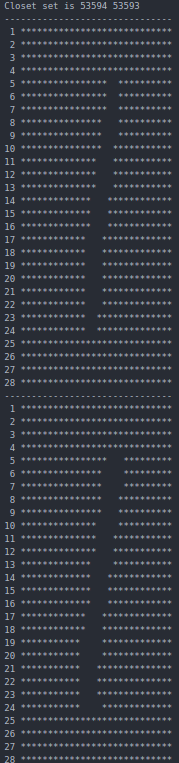

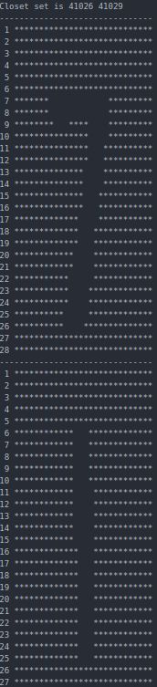

##### 后期文档分工
注释都由完成cpp文件的人自己负责

* 党员，algorithm3文档
* 中舟，algorithm4文档
* 班长，cp, image, algorithm1, algorithm2文档

### 贡献者
欧光文，庄嘉鑫，徐嘉辰，夏中舟

### 参考资料：
1. [LCG](http://blog.csdn.net/jackytintin/article/details/7798157)
2. [box-Muller](https://www.zhihu.com/question/29971598)
3. [h文件和cpp文件](http://www.cnblogs.com/ider/archive/2011/06/30/what_is_in_cpp_header_and_implementation_file.html)
4. [makefile](http://wiki.ubuntu.org.cn/%E8%B7%9F%E6%88%91%E4%B8%80%E8%B5%B7%E5%86%99Makefile:MakeFile%E4%BB%8B%E7%BB%8D)
5. [ubuntu简单写makefile](http://wiki.ubuntu.org.cn/%E8%B7%9F%E6%88%91%E4%B8%80%E8%B5%B7%E5%86%99Makefile:MakeFile%E4%BB%8B%E7%BB%8D)
6. [大端小端](http://blog.sina.com.cn/s/blog_9f1c0931010193ct.html)
7. [大端小端转换](http://www.blogjava.net/tinysun/archive/2009/12/31/307952.html)
8. [google注释书写规范](http://zh-google-styleguide.readthedocs.io/en/latest/google-cpp-styleguide/comments/)
